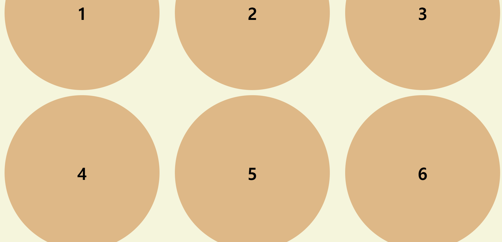
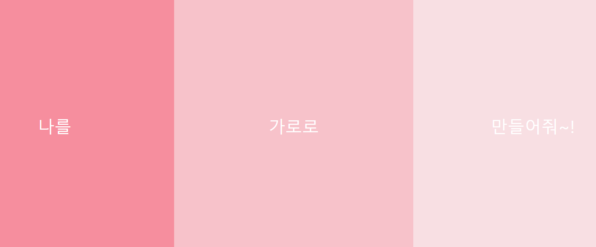
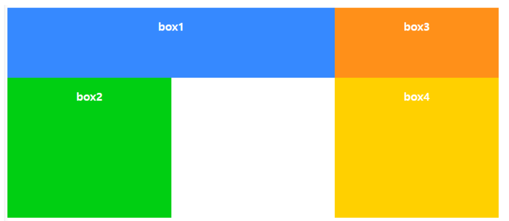

# week1 - html, css 실습 및 과제

## [실습 : 1]

https://flexboxfroggy.com/#ko
위 주소에 접속해 flex에 익숙해져봅시다!

## [실습 : 2]

https://cssgridgarden.com/#ko
위 주소에 접속해 grid에 익숙해져봅시다!!

## [1번 과제]

원을 올바른 위치에 이동해주세요!

1. 숫자가 원 중앙에 위치하도록 해주세요!
2. 3x3 형식으로 원이 규칙적으로 위치하도록 코드를 작성해주세요!
3. 색은 원하는 색으로 해도 가능해요.
4. 쉽게 하셨다면 원 별로 색깔도 지정을 해보아요!
   

## [2번 과제]

이런이런 3개의 박스가 세로로 정렬이 되어있네요;;
게다가 화면창의 크기를 바꾸면 가운데만 커지는 문제가 발생해요. 박스안의 글씨를 읽을 수 있도록 가로로 정렬하고, 세 박스 모두 화면창의 크기에 맞추어 일정하게 크고 작아지게 만들어보아요! (필요없는 코드는 지워도 됩니다!)

## [3번 과제]

grid를 사용하여 아래그림과 같이 배치되도록 만들어주세요!!

## [4번 과제]

영상 결과물을 보고 따라만들어 보세요! 단 아래의 조건을 지키셔야 합니다!

1. html 코드 수정가능
2. height 높이는 마음대로! 단, 배경색이 있는 모든 태그들은 width를 꽉 채워요.
3. 타입선택자, 전체선택자, class 부여 등 자유롭게 과제 진행!
4. 색은 원하는 색으로 해도 된다! 다른 색인걸 확인만 할 수 있으면 OK!
5. 추가로 주어진 내용 외에 자유롭게 추가하고 싶은 것들이 있다면 뭐든 OK!
6. css 시트 적용 방법은 내부, 외부, 인라인등 편한 방식으로 자유롭게 제작해주세요!

## [5번 과제] : 4.10일 6pm까지 자기소개 페이지 제작하기

### 과제 진행은 fork 혹은 clone을 받으신 이후에 자신의 레포지스토리를 만든 후 진행하시면 됩니다.

### 다들 화이팅!!! 1 ~ 4번과제는 3월 31일 일요일 자정까지 완료한 레포지스토리를 과제 페이지에 제출해주시면 됩니다.

### 어떤 방식으로 코드 작성했는지 간단하게 요약할 수 있다면 더욱 좋아요!
